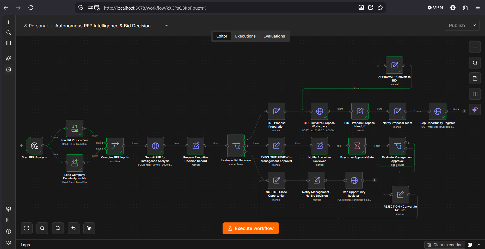
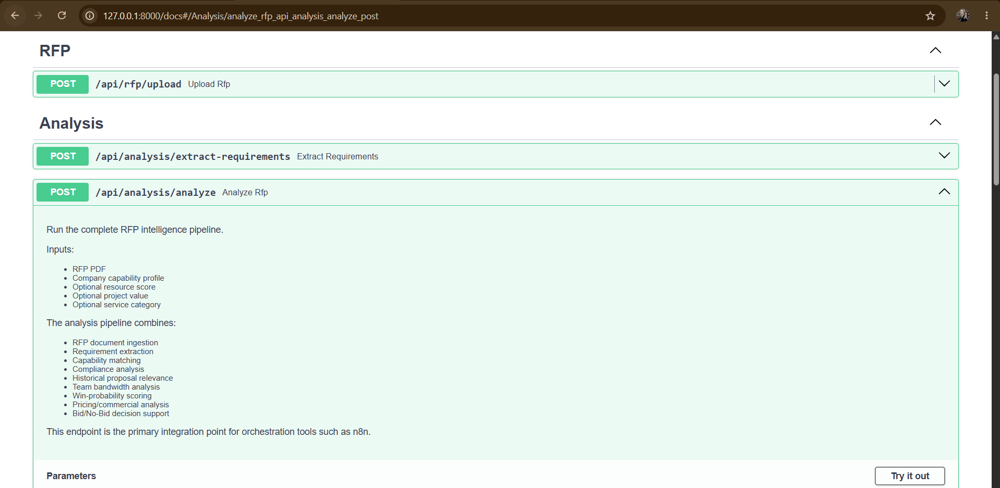
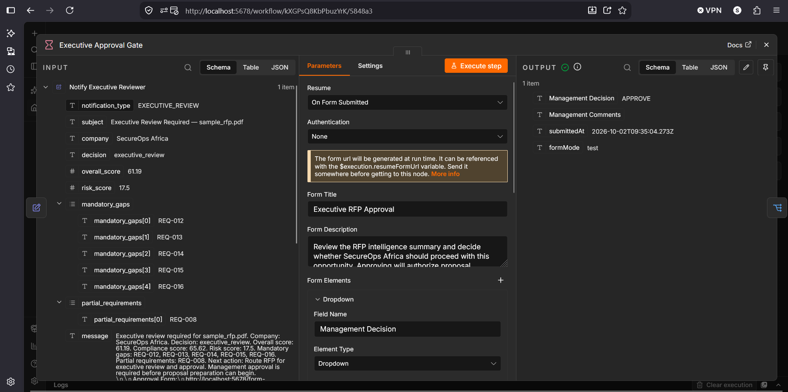
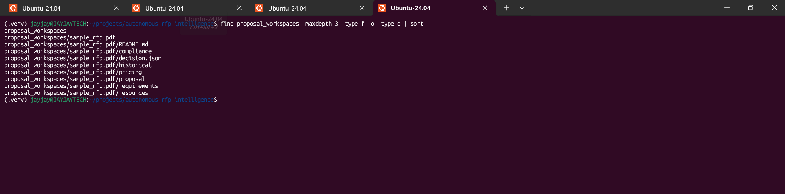
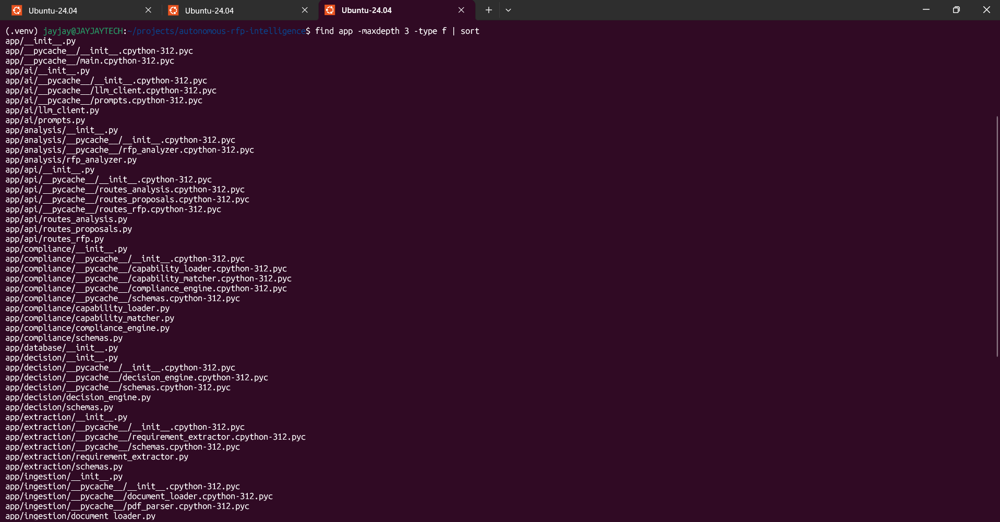

# Autonomous Tender/RFP Intelligence & Bid/No-Bid Decision Engine

An end-to-end cybersecurity-focused RFP intelligence and decision-support platform that ingests tender documents, extracts requirements, evaluates organizational capability and compliance, incorporates historical proposal relevance, team bandwidth, pricing models, and produces an explainable Bid / Executive Review / No-Bid decision.

The project combines a Python/FastAPI analysis engine with an n8n orchestration workflow and a Google Sheets opportunity register.

## Workflow Preview

The complete n8n workflow orchestrates RFP analysis, Bid / Executive Review / No-Bid routing, management approval, proposal workspace initialization, and opportunity registration.




---

## Project Objective

Organizations receive tender and Request for Proposal (RFP) documents containing technical, commercial, experience, personnel, implementation, training, legal, and submission requirements.

Manually reviewing every opportunity can be time-consuming and inconsistent.

This project automates the early-stage opportunity assessment process by:

1. Ingesting RFP documents.
2. Extracting structured requirements using an AI-assisted extraction layer.
3. Comparing requirements against company capabilities.
4. Producing a Compliance Matrix.
5. Matching relevant historical proposals.
6. Evaluating team bandwidth.
7. Evaluating pricing and commercial fit.
8. Calculating an evidence-based win-probability score.
9. Producing an explainable Bid / Executive Review / No-Bid decision.
10. Routing the opportunity through an automated n8n workflow.
11. Creating proposal workspaces for approved BID opportunities.
12. Recording decisions in a Google Sheets Opportunity Register.

---

## Architecture

```text
                         ┌──────────────────────┐
                         │      RFP PDF         │
                         └──────────┬───────────┘
                                    │
                                    ▼
                         ┌──────────────────────┐
                         │ Document Ingestion   │
                         │      / Parsing       │
                         └──────────┬───────────┘
                                    │
                                    ▼
                         ┌──────────────────────┐
                         │ AI Requirement       │
                         │ Extraction            │
                         └──────────┬───────────┘
                                    │
                                    ▼
                         ┌──────────────────────┐
                         │ Compliance Matrix    │
                         │ + Capability Match   │
                         └──────────┬───────────┘
                                    │
              ┌─────────────────────┼─────────────────────┐
              ▼                     ▼                     ▼
      Historical Proposals    Team Bandwidth       Pricing Models
              │                     │                     │
              └─────────────────────┼─────────────────────┘
                                    ▼
                         ┌──────────────────────┐
                         │ Win Probability     │
                         │ Decision Support     │
                         └──────────┬───────────┘
                                    │
                                    ▼
                         ┌──────────────────────┐
                         │ Bid/No-Bid Engine    │
                         └──────────┬───────────┘
                                    │
             ┌──────────────────────┼──────────────────────┐
             ▼                      ▼                      ▼
           BID             EXECUTIVE REVIEW              NO-BID
             │                      │                      │
             ▼                      ▼                      ▼
      Proposal Workspace     Management Approval           Close
             │                      │                      │
             │              ┌───────┴───────┐              │
             │              ▼               ▼              │
             │           APPROVE          REJECT            │
             │              │               │               │
             └──────────────┤               └───────────────┤
                            ▼                               ▼
                     Opportunity Register          Opportunity Register
                            │                               │
                            └──────────────┬────────────────┘
                                           ▼
                                  Google Sheets

## System Demonstration

The following screenshots demonstrate the implemented RFP intelligence pipeline, orchestration workflow, approval process, proposal workspace initialization, and Python application structure.

### 1. n8n Workflow Overview

The complete n8n orchestration workflow connects RFP analysis to BID, Executive Review, and NO-BID paths, including management approval and opportunity registration.


### 2. RFP Analysis Result

The FastAPI backend processes the sample RFP and returns structured intelligence used by the decision engine.



### 3. Executive Approval Form

Executive Review opportunities are routed through an n8n management approval gate supporting APPROVE or REJECT decisions and management comments.



### 4. Proposal Workspace

Approved BID opportunities initialize a structured proposal workspace containing decision evidence and preparation directories.



### 5. Python Project Structure

The application is organized into dedicated modules for ingestion, extraction, compliance, decisioning, scoring, pricing, resources, proposals, APIs, and AI integration.


